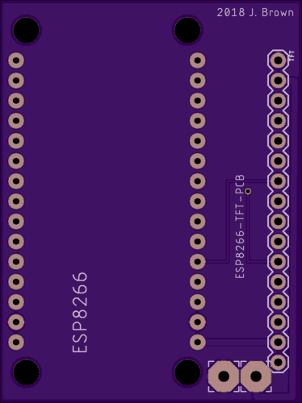
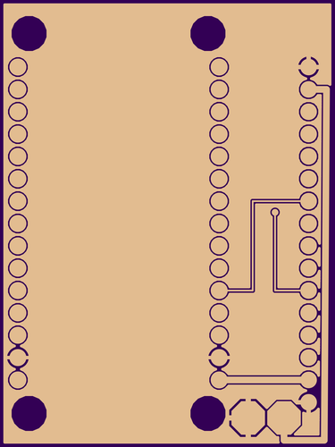
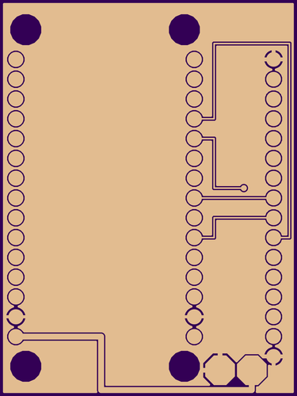

# ESP8266-TFT-PCB
Eagle files for a printed circuit board to connect a Node MCU ESP8266 Wifi board and a 1.8 TFT ST7735 display.

Below are the pin mappings from the display to the board. 
SCL ->  SCK   ->  D5
SDA ->  MOSI  ->  D7
VCC     +3.3V
LED-    GND
LED+    VIN +5V
GND     GND

Here's what the board looks like:

Here are the traces.

And here's [what you can do with it](https://github.com/brownjd/ESPStockTicker) 
